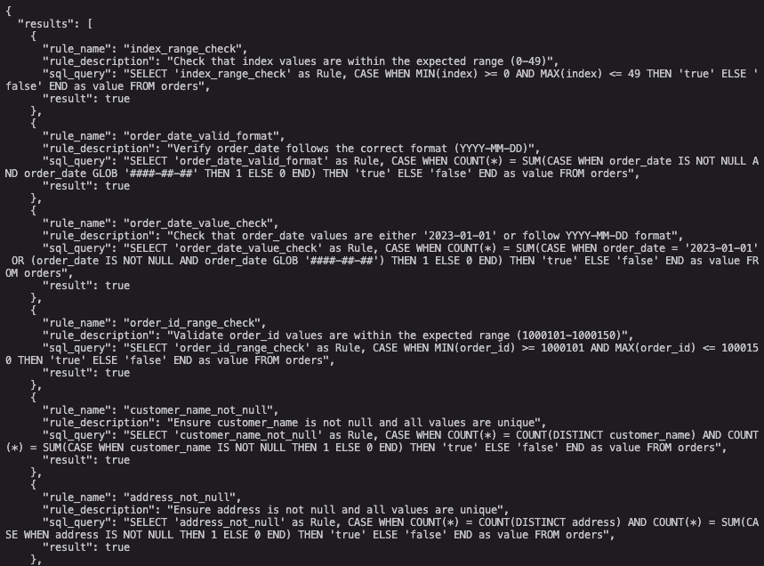

# Data Quality Automation Demo

A LangChain-powered demonstration of automated data quality rule generation using Large Language Models. This project showcases how to analyze database tables through statistical profiling, generate deterministic quality rules, convert them to SQL queries, and validate against real datasets.

## Overview

This demo uses statistical profiling and prompt chaining to automatically create comprehensive data quality frameworks from database tables. The system profiles your data with comprehensive statistics, generates appropriate validation rules, converts them to executable SQL queries, and provides detailed assessment reports.

### Key Features

- **Statistical Profiling**: Analyzes database tables with comprehensive statistics instead of raw sample data
- **Automated Rule Generation**: Creates column-specific quality rules based on data distributions and patterns
- **SQL Query Generation**: Converts rules into SQLite-compatible validation queries  
- **Real-time Validation**: Tests generated rules against actual database tables
- **Comprehensive Reporting**: Provides detailed summaries with rule definitions and test results
- **LangChain Integration**: Uses structured output with Pydantic models for type safety
- **Configurable Database**: Supports any SQLite database path for maximum flexibility
- **Scalable Architecture**: Handles large datasets efficiently through statistical summaries

## Demo Output

Here's what the data quality analysis looks like in action:



The system automatically generates comprehensive data quality rules, converts them to SQL queries, and provides detailed validation results with clear pass/fail status for each rule.

## Quick Start

### 1. Environment Setup

```bash
# Create and activate virtual environment
python -m venv venv
source venv/bin/activate  # macOS/Linux

# Install dependencies
pip install -r requirements.txt
```

### 2. Configuration

Create a `.env` file in the project root:

```env
OPENAI_API_KEY="your-openrouter-api-key"
```

### 3. Run the Demo

```bash
python demo.py
```


## How It Works

### Statistical Profiling Approach

Instead of using raw sample data, the system generates comprehensive statistical profiles including:
- Column names and data types
- Statistical summaries (min, max, mean, std, percentiles)
- Null counts and percentages
- Unique value counts
- Sample values for context

This approach is more efficient, scalable, and provides better insights for rule generation.

### LangChain Architecture

The system uses three sequential LangChain LCEL chains with structured Pydantic output:

1. **Rules Chain**: `statistical_profile → DataQualityRules`
   - Analyzes statistical profile to generate column-specific validation rules

2. **SQL Chain**: `rules → SQLQueries` 
   - Converts rules into executable SQLite queries

3. **Summary Chain**: `all_results → DataQualitySummary`
   - Provides comprehensive analysis report

### Structured Output Models

```python
class DataQualityRule(BaseModel):
    rule_name: str = Field(description="Name of the data quality rule")
    rule_description: str = Field(description="Description of what the rule validates")

class SQLQuery(BaseModel):
    rule_name: str = Field(description="Name of the rule this query validates")
    sql_query: str = Field(description="SQLite-compatible query that returns true/false")

class ValidationResult(BaseModel):
    rule_name: str = Field(description="Name of the validated rule")
    rule_description: str = Field(description="Description of the rule")
    sql_query: str = Field(description="SQL query that was executed")
    result: bool = Field(description="Whether the validation passed (true) or failed (false)")

class DataQualitySummary(BaseModel):
    results: List[ValidationResult] = Field(description="List of validation results")
    total_rules: int = Field(description="Total number of rules validated")
    passed_rules: int = Field(description="Number of rules that passed")
    failed_rules: int = Field(description="Number of rules that failed")
```

## Usage Examples

### Basic Usage (Default Database)

```python
from DQAgent import DQAgent

# Initialize agent with default database
agent = DQAgent()

# Run complete data quality analysis on a table
result = agent.run(table_name="orders")

# Display results
print(f"Total Rules: {result['total_rules']}")
print(f"Passed Rules: {result['passed_rules']}")
print(f"Failed Rules: {result['failed_rules']}")

# Access individual validation results
for validation in result['results']:
    print(f"Rule: {validation['rule_name']}")
    print(f"Status: {'PASSED' if validation['result'] else 'FAILED'}")
    print(f"Description: {validation['rule_description']}")
    print("---")
```

### Custom Database Path

```python
from DQAgent import DQAgent

# Initialize agent with custom database
agent = DQAgent(db_path="my_production_data.sqlite")

# Run analysis
result = agent.run(table_name="customer_orders")
```

## Development Notes

- Uses LangChain Expression Language (LCEL) for workflow orchestration
- Pydantic models ensure type-safe structured output
- ChatPromptTemplate provides better prompt management
- Structured output eliminates JSON parsing errors
- SQLite queries use aggregate functions for column-level validation

## Target Use Case

Enables data analysts and engineers to quickly establish data quality frameworks by providing sample data and receiving automated rule generation and validation - perfect for rapid prototyping and data pipeline validation.